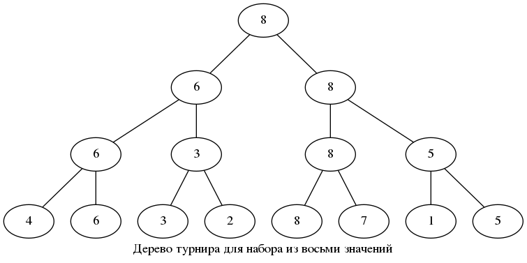

# Links

- [Graphviz - Graph Visualization Software](https://www.graphviz.org)
- [Documentation](https://www.graphviz.org/documentation/)
- [Command-line Usage](https://graphviz.gitlab.io/_pages/doc/info/command.html)
- [dot](https://graphviz.gitlab.io/_pages/pdf/dotguide.pdf)

- [GraphViz Pocket Reference](http://graphs.grevian.org)
- [Examples](http://graphs.grevian.org/example)
- [Reference](http://graphs.grevian.org/reference)
- [Make A Graph](http://graphs.grevian.org/graph)
